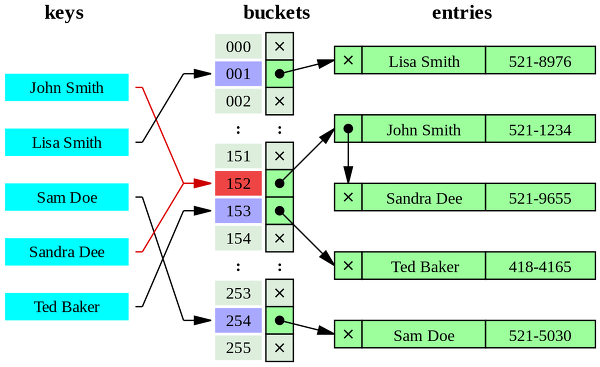
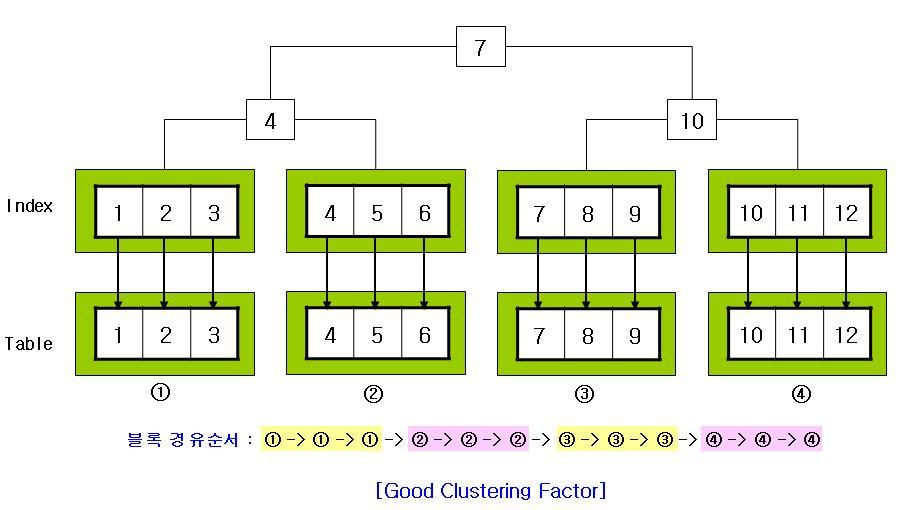
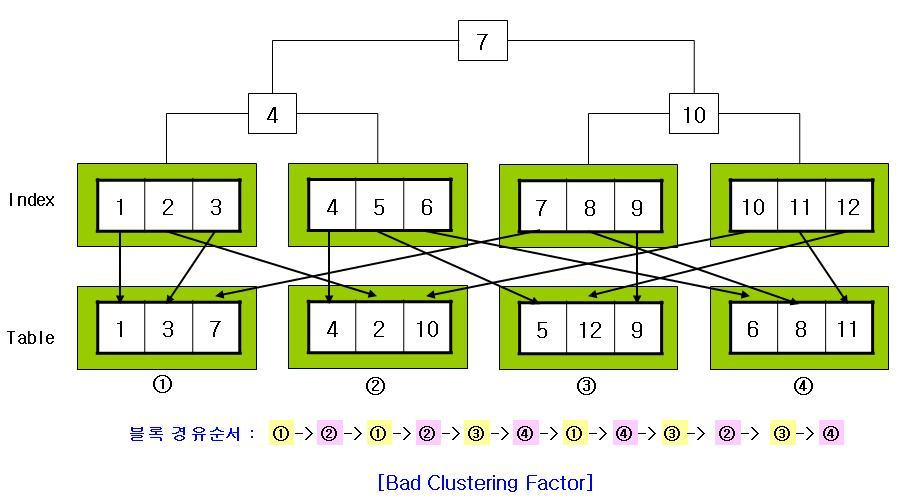

## 인덱스와 B-tree

### B-tree
#### 특징
- invented by Rudolf Bayer
- depth 의 균형을 유지: self-balancing tree
- 정렬 상태를 유지
- 삽입/삭제/탐색이 logarithmic time 에 가능: O(NlogN)

#### [정의](https://en.wikipedia.org/wiki/B-tree)
##### order M 인 b-tree 가 있을 때
1. 각 노드는 최대 M 개의 자식을 가짐
2. 각 인터널 노드(루트, 리프 제외한 모든 노드)는 최소 ceil(M/2) 의 자식을 가짐
3. 루트는 리프가 아닐 경우 최소 2개의 자식을 가짐
4. 자식이 k개인 노드는 k-1 개의 데이터를 가짐
5. 모든 리프 노드는 같은 level 에 존재


#### B+tree
- B-tree 에서 leaf node 에만 key 값이 존재하는 tree
- leaf node 들은 linked list 로 scan 가능하도록 구성
- 대부분 DBMS 는 B+tree 를 사용


### 기타 인덱스
#### bitmap
- 데이터를 비트 플래그로 변환해서 저장
- cardinality 가 낮은 필드에 대해서 효과적
- 갱신 시 lock 으로 인한 비용 발생
#### hash
- 등가 검색(동등 비교) 시 최대의 효과
- range 검색이나 정렬 불가
- postgresql 지원, Oracle 의 reverse key index 지원



#### R tree
- 공간 데이터를 저장
- 공간을 MBR(Minimum Bounding Rectangle)로 분할하여 저장.
- 상위 MBR 은 하위 MBR 을 포함하는 계층적 구조
- 범위 검색이 가능하여 주로 지도 검색에서 사용


## 인덱스를 잘 활용하려면
### cardinality, selectivity
- cardinality
   - select count(distinct (data)) from table;
   - 값의 분포 균형을 수치화
   - cardinality 가 높을수록 고르게 분포
- selectivity
   - (select count/total records)
   - 특정 필드 조건으로 선택되는 레코드의 비율
   - ex) 200개 레코드 중 2개 선택: 2/200 = 0.01
- 인덱스를 사용하는 것이 좋은지 판단하려면
   - cardinality 가 높을수록 좋음
   - selectivity 가 낮을수록 좋음
      - 대체로 5~10% 이하. 그 이상의 경우는 full scan 이 빠를 수 있음

### clustering factor
- 저장소에 같은 값이 물리적으로 뭉쳐 존재하는지 알 수 있는 지표
- clustering factor 낮은 경우
   - 인덱스 스캔에 유리
   
- clustering factor 높은 경우
   - 인덱스 스캔에 불리
   

## 인덱스로 성능 향상이 어려운 경우
- 검색/결합 조건을 바탕으로 데이터를 효율적으로 선별할 조건을 찾아야 함
### 선별 조건이 존재하지 않음
```sql
SELECT order_id, receive_date FROM Orders;
``` 

### 레코드를 제대로 선별하지 못하는 경우

- 총 데이터: 약 1억개

|process_flg|record count|
|--|--|
|1(주문단계)| 200만 건|
|2(주문완료)| 500만 건|
|3(재고확인중)| 500만 건|
|4(배송준비중)| 500만 건|
|5(배송완료)| 8,300만 건|

```sql
SELECT order_id, receive_date FROM Orders
  WHERE process_flg = '5';
```
   - selectivity 가 83% 로 높은 수치
   - full scan 보다 느려질 수 있음

#### 입력 매개변수에 따라 selectivity 가 변동하는 경우
1. 기간을 지정할 수 있는 criteria
   - 기간을 길게 잡을수록 selectivity 가 높아질 수 있음
   ```sql
   SELECT order_id FROM Orders
     WHERE receive_date BETWEEN :start_date AND :end_date;
   ```
2. 규모가 클 수 있는 criteria
   - 규모가 큰 몰일 경우 selectivity 가 높아질 수 있음
   ```sql
   SELECT COUNT(*) FROM  Orders
     WHERE shop_id=:sid;
   ```
### 인덱스를 사용하지 않는 검색 조건
1. 중간 일치, 후방 일치의 LIKE 연산자
   ```sql
   SELECT order_id FROM Orders
     WHERE shop_name LIKE '%대공원%'
   ```
   - LIKE 연산자를 사용하는 경우, 인덱스는 전방 일치('대공원%') 에만 적용할 수 있음
   - String index 는 lexicographic order 로 저장되기 때문

2. 색인 필드로 연산하는 경우, 색인 필드로 함수 사용하는 경우
   ```sql
   SELECT * FROM SomeTable 
     WHERE col_1 * 1.1 > 100;
   ```
   ```sql
   SELECT * FROM SomeTable 
     WHERE LENGTH(col_1)=10;
   ```
   - 색인 필드로 연산 시 해당 필드를 모두 연산해봐야 하기 때문에 full scan

3. IS NULL 을 사용하는 경우
   ```sql
   SELECT * FROM SomeTable 
     WHERE col_1 IS NULL;
   ```
   - 일반적으로 색인 필드의 데이터에 NULL 이 존재하지 않음. 따라서 full scan

4. 부정형을 사용하는 경우
   ```sql
   SELECT * FROM SomeTable 
     WHERE col_1 <> 100;
   ```

## 인덱스를 사용할 수 없는 경우 대처법
### 애플리케이션에서 제한
- ex) UI 에서 제한 
- 완벽하게 제한하기 어려울 수 있음
### 데이터 마트로 대처
- BI/DWH 관점
- 접근 대상을 상대적으로 적게 추려서 I/O 를 줄임
  - ex) 스몰 마트
- 자주 사용하는 질의에 대하여 미리 인덱싱
  - ex) kylin + superset
#### 데이터 마트 채택 시 주의점
- 데이터 신선도: 동기화 주기
- 데이터 마트 크기: 사전 집계하여 크기 축소 검토
- 데이터 마트 수: 관리 가능한 적절한 개수를 검토
- 배치 윈도우: 마트 생성 job 의 스케쥴, 부하 고려하여 적정 윈도우 검토
### 인덱스 온리 스캔으로 대처
- 조건이 존재하지 않는 full scan 일 때
    ```sql
    SELECT order_id, receive_date
      FROM Orders;
    ```
    ```
        ----------------------------------------------------------------------------
        | Id  | Operation         | Name   | Rows  | Bytes | Cost (%CPU)| Time     |
        ----------------------------------------------------------------------------
        |   0 | SELECT STATEMENT  |        |     7 |   868 |     3   (0)| 00:00:01 |
        |   1 |  TABLE ACCESS FULL| ORDERS |     7 |   868 |     3   (0)| 00:00:01 |
        ----------------------------------------------------------------------------
    ```
- 다음과 같이 가져올 필드에 대해서 인덱스를 생성한다면 인덱스 온리 스캔으로 fast full scan 가능
    > 인덱스만 사용하므로 plan 에 인덱스 이름만 표시
    ```sql
    CREATE INDEX CoveringIndex ON Orders (order_id, receive_date);
    ```
    ```sql
        ---------------------------------------------------------------------------------------
        | Id  | Operation             | Name          | Rows  | Bytes | Cost (%CPU)| Time     |
        ---------------------------------------------------------------------------------------
        |   0 | SELECT STATEMENT      |               |     7 |   154 |     3   (0)| 00:00:01 |
        |   1 |  INDEX FAST FULL SCAN | COVERINGINDEX |     7 |   154 |     3   (0)| 00:00:01 |
        ---------------------------------------------------------------------------------------
    ```
- row(record) 지향 DBMS 를 column(field) 지향 DBMS 와 유사하게 사용하는 관점

#### 인덱스 온리 스캔의 주의사항
- DBMS 에 따라 사용할 수 없는 경우 있음 (2015년 8월 기준으로 대부분 지원)
- 인덱스 필드 수 제한
- 갱신 부하가 커짐
- 정기적 인덱스 리빌드 필요(compaction)
- SQL 구문에 새로운 필드 추가 시 사용 불가할 수 있음


